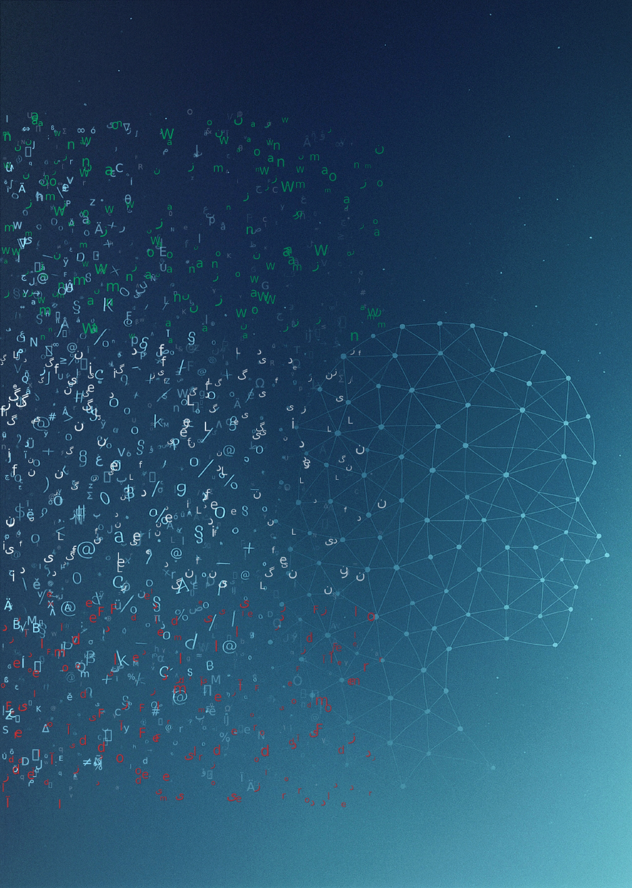

# Hadi Mohammadi

**Senior AI & Data Science Expert** at [AcademicTransfer](https://www.academictransfer.com)
**PhD in Explainable NLP** — [Utrecht University](https://www.uu.nl/staff/HMohammadi), 2026

---

## About

I bridge AI research and applied data science. At **AcademicTransfer** I lead production ML systems for academic recruitment — CV ranking, job-description optimisation, and recruiter-facing AI tooling. In parallel, I just defended my PhD at **Utrecht University** on making Large Language Models more interpretable, robust, and culturally aware.

My strongest interests sit where measurable engineering meets explainability research: shipping models that work in production *and* expose **why** they make each decision.

## Doctoral thesis

<table>
<tr>
<td width="240" valign="top">
  
</td>
<td valign="top">

### Let Me Explain! Explainable NLP for Understanding Large Language Models

**Defense:** 21 February 2026 · Utrecht University · ~290 pages

A six-chapter dissertation on explainability across the full LLM life cycle:
a survey of XAI for NLP, a transparent BERT pipeline for online sexism detection,
SHAP-driven probing of AI-text-detector robustness, content-vs-demographic
explanations for LLM annotators, cross-cultural moral-alignment evaluation
of 26 LLMs against the World Values Survey and PEW, and the **EvalMORAAL**
chain-of-thought-plus-LLM-as-judge framework benchmarking 20 models across
64 countries.

</td>
</tr>
</table>

## Publications & code

Each chapter has a peer-reviewed paper and a public companion repository released as `v1.0-thesis`, archived on Zenodo with a permanent DOI.

| # | Paper | Venue | Read | Code |
|---|---|---|:---:|:---:|
| 1 | A Survey of Explainable NLP | Journal — under review | — |  |
| 2 | A Transparent Pipeline for Identifying Sexism in Social Media | *Applied Sciences* (MDPI), 2024 |  |  |
| 3 | Explainability-Based Token Replacement on LLM-Generated Text | arXiv preprint, 2025 |  |  |
| 4 | Reliability of LLM Annotations under Demographic Bias and Model Explanation | GeBNLP @ ACL 2025 |  |  |
| 5 | Exploring Cultural Variations in Moral Judgments with LLMs | *Computational Linguistics in the Netherlands J.* (in press) |  |  |
| 6 | EvalMORAAL — Interpretable CoT and LLM-as-Judge for Moral Alignment | \*SEM @ ACL 2026 (in press) |  |  |

## Industry tech stack

**Languages**

**Machine learning & deep learning**

**LLMs, NLP & explainability**

**Data engineering**

**MLOps & DevOps**

**Cloud & HPC**

**APIs, web & visualization**

## Selected applied work

- **[AT-CV-Priority-Sorter](https://github.com/mohammadi-hadi/AT-CV-Priority-Sorter)** — production ML pipeline ranking academic CVs by fit-to-vacancy at AcademicTransfer
- **[FBB Sustainability Analysis](https://github.com/Firmbackbone/fbb-sustainability-analysis-cli)** — environmental-impact analysis CLI on a Dutch firm panel

## At a glance

## Get in touch

Open to research collaborations, applied AI consulting in NL/EU, and conversations on explainability, LLM evaluation, and cultural alignment.

---

Most industry work lives in private repositories at AcademicTransfer · Research code is open at the chapter repos linked above.

