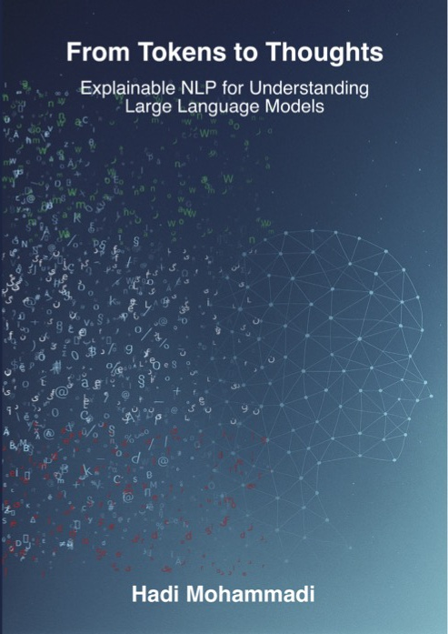

# Hadi Mohammadi

**Machine Learning Scientist** | **PhD in Explainable AI** (Utrecht University, 2025)

Building production ML systems for high-stakes applications. 6+ years developing end-to-end pipelines for NLP, classification, ranking, and optimization at scale.

---

## Current Role

**Senior Data Science & AI Expert** @ [AcademicTransfer](https://corporate.academictransfer.com/) (2023 - Present)
- Leading AI strategy for academic recruitment platform serving 10M+ users
- Deployed active learning ranking systems with 17% match quality improvement
- Built end-to-end ML pipelines for large-scale recruitment platform
- Reduced manual review by 50% through automated screening and classification

---

## PhD Thesis

  

  <strong>From Tokens to Thoughts: Explainable NLP for Understanding Large Language Models</strong> 
  <em>Utrecht University, 2025</em>

Focus areas:
- Detection and classification systems for harmful content (sexism, generated text)
- Cultural fairness and moral alignment in LLMs across 55+ countries
- Annotation reliability frameworks for improving data quality
- Robust NLP systems against adversarial inputs

**MSc in Industrial Engineering** — University of Tehran
*Reinforcement Learning for Dynamic Optimization*

**Research Funding**: €45,500 in competitive grants (2023-2025)

---

## Publications

| Year | Title | Venue | Links |
|------|-------|-------|-------|
| 2025 | LLM Annotation Reliability & Data Quality | ACL (GeBNLP) | [Paper](https://aclanthology.org/2025.gebnlp-1.9/) \| [arXiv](https://arxiv.org/abs/2507.13138) |
| 2025 | Cultural Moral Judgments in LLMs | ECAI (LUHME) | [Paper](https://doi.org/10.3233/FAIA241173) \| [arXiv](https://arxiv.org/abs/2506.12433) |
| 2025 | EvalMORAAL: LLM Evaluation Framework | ACL | [arXiv](https://arxiv.org/abs/2510.05942) |
| 2024 | Transparent Sexism Detection Pipeline | Applied Sciences | [Paper](https://doi.org/10.3390/app14198620) |
| 2024 | AI-Generated Text Detection | CLIN Journal | [Paper](https://clinjournal.org/clinj/article/view/182) |
| 2023 | Multi-Model Detection for Online Sexism | CLEF | [Paper](https://ceur-ws.org/Vol-3497/paper-111.pdf) |

[Full Publications →](https://mohammadi.cv/Publications.html)

---

## Featured Projects

### Production ML Systems (AcademicTransfer)
- **CV Priority Sorter** — Active Learning + LLM system for CV prioritization combining GPT-4 reasoning with BERT embeddings. *Impact: 20% reduction in hiring time*
- **CV Matcher** — Semantic matching using Sentence Transformers and vector search for job-candidate alignment. *Impact: 40% improved matching accuracy*
- **Analytics Dashboard** — Real-time recruitment analytics with NL2SQL using Vanna AI for natural language queries. *Impact: Decision support for 50+ universities*
- **Concept Extractor** — NER + LLM-based skill extraction from academic CVs with Knowledge Graphs

### Open Source
- [**FBB Sustainability**](https://github.com/Firmbackbone/fbb-sustainability-analysis-cli) — NLP-based sustainability content analysis (FIRMBACKBONE/Utrecht University)
- [**Publication Package**](https://github.com/mohammadi-hadi/Publication_package) — Complete PhD thesis materials, code, and data

---

## Technical Expertise

**ML/DL**: PyTorch, TensorFlow, Transformers, BERT, GPT, LLaMA
**Methods**: Active Learning, Classification, NLP, Reinforcement Learning, Optimization
**Data & Scale**: PySpark, Spark, SQL, Hadoop, Snowflake, ETL pipelines
**MLOps**: Azure ML, MLflow, Docker, Kubernetes, CI/CD
**Languages**: Python, R, SQL

---

## Background

Cross-disciplinary expertise spanning Machine Learning, NLP, and Industrial Engineering (optimization). Research bridges academic innovation with production systems.

---

## Connect

---

Senior Data Science & AI Expert at AcademicTransfer | PhD from Utrecht University

